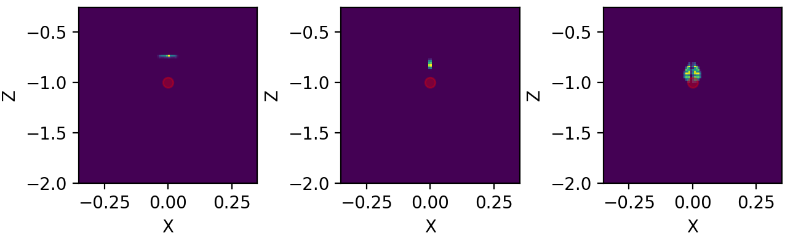
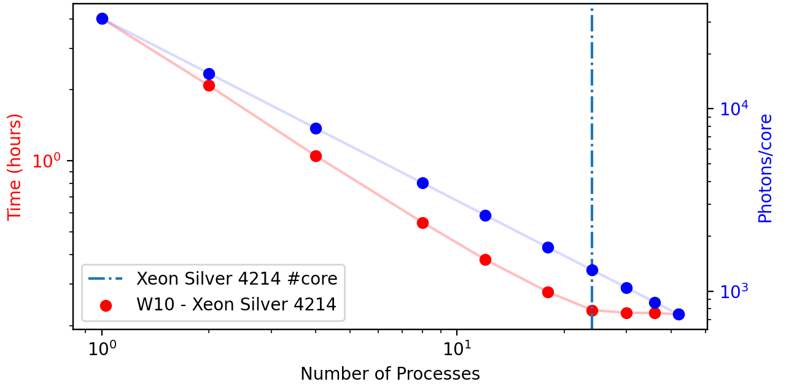

Examples
========

Following documents explains how module works by means of several examples,in ascending order of complexity.

Pair of Lenses
--------------
Optical system is simply a pair of lenses with same focus :math:`f = 2` and clear aperture of :math:`ap = 1.5`. We have used a perfect collimated source
of :math:`d_{src} = 2` and distance between lenses are :math:`d = 6`. This distance is relative to the plane sides of each lens as::

>>> a.create_thin_lens([0, 0, zlens1], focus1, 1.5, 1.43, 'convex-plane')

Creates a thin 'convex-plane' in which the center of the plane part is given by first *array_like* argument. If we go block by block in our simulation::

>>> a = ot.Simu(5, 5, 20, res)

Creates the simulation cell size for a given resolution. In the next line::

>>> a.d2_source(r_src, [0, 0, -9.5], [0, 0, 1], 0.0, 1)

Creates a bi-dimensional source with a radius r_src centered at [0, 0, -9.5] and with photons in the [0, 0, 1] direction. Last two arguments are used for creating
a diverging source. In this case we have set divergence at 0.0 with a single photon in this direction. After the creation of both lenses, we must created our analyses plans::

>>> for z in z_array:
>>>     a.create_analysis_plan([0, 0, 1], z)

Analyses plan are the core of orsaytrace. They bind together any photons that any given time satisfies the plane equation:

.. math::
    a x + b y + c z = d

Normal vector :math:`\vec{n} = [a, b, c]` and :math:`d` comes from first and second argument of *create_analysis_plan*, respectively.
Normal vector is not intensity sensitive, which means::

>>> a.create_analysis_plan([0, 0, 1], 1)

Will create same plan as::

>>> a.create_analysis_plan([0, 0, 2], 1)

Following, we can view our created elements using (check complete documentation for available arguments)::

>>> a.show_created_elements('all-noplan')

And we can run our simulation by::

>>> photon_lists = a.run()

Simulation result is an numpy.array of shape based on the number of planes created. This is an photon_list object (check complete documentation for more) and has an
important attribute '.photons'. This means that each index of this list is a photon_list and each photon_list has a 'photons' attribute. Other attributes are 'normal' and 'value'
corresponding to the plane equation of the indicated plane. As we will see in the future, this class has also a 'condition_dict' attribute which forces the photon
to have a specific property before being appended to class.photon_list.

Optionally, one can also plug simulation result in::

>>> a.show_elements(photon_lists, 'all-noplan')

This will produce a 3D matplot lib with all the photons and elements created for each analysis plan.

Results
*******

Note that after simulation is finished, we run a loop over our photon_lists object, the returned value of simulation run. As we have said, those are planes and contain
convenient functions if you dont with to work with the whole set of 'photons' attribute. Just remember that each photon in photon_list.photons contains much more
information, such as its position, intensity, normal vector, number of reflections, refractions etc. For the sake of clarity in this first example, we will show what::

>>> photon_list.avg_divergence([0, 0, 1])

is doing. Source code show us::

    def avg_divergence(self, vec_ref):
        '''
        Calculates the average photon divergence from given a vector reference.

        Parameters
        ----------
        vec: array_like
            A 3 dimensional array of given direction.

        Returns
        ------
        float
            A float provenient from a numpy.average based on vector direction and propagation direction for each photon

        '''
        vec_ref = vec_ref / numpy.linalg.norm(vec_ref)
        vals = numpy.average([numpy.dot(photon.normal, vec_ref)**2 for photon in self.photons])
        return vals

This means that, for each photon_list, we are avering the scalar product between the photon.normal and a given reference vector. So if you have a perfect collimated source
propagating in [0, 0, 1] and applied this function using a  [0, 0, 1] reference vector, you would have a result of 1.0 because all individual photons are propagating in this
direction and the scalar product is always 1.0. If your photons start to diverge from [0, 0, 1], scalar products are reduced and average is :math:`> 1`.

Other three functions are easier to understand. They calculate the average distance of the photons in xy plane for a [0, 0] position in::

>>> photon_list.avg_distance_axis_z([0, 0])

And calculate absolute position in 3 dimensional for::

>>> photon_list.avg_position()

If one wish to see the created elements:

    View from show_elements using a resolution of 0.02.

.. figure:: figures/Example01_res0-05_side_view.png
    :align: center

    Side view from show_elements using a resolution of 0.05.

Figures below show quantitative results of the simulation. Look how divergence is :math:`= 1.0` at the beginning and reduces almost abruptly as it reaches first lens
second lens reduces slighly beam divergence relative to [0, 0, 1]. In the top right, we see beam starts with a 0.15 size and reaches a minimum during first focus. Second lens
refocalizes the diverging beam of approximately 0.30. Beam reaches a minimum and continues to diverge until simulation cell is over.

.. figure:: figures/Example01_res0-02.png
    :align: center

    Quantitative Results from a resolution of 0.02.

Finally, both cells at the botton show the average distance in X and Y. As simulation is symmetrical relative to those axis, those must be values under our resolution
factor. Both are 100x smaller than our resolution.

Code
****

examples01.py::

    import orsaytrace.trace as ot
    import numpy
    import matplotlib.pyplot as plt

    z_array = numpy.linspace(-9.0, 9.0, 101)
    focus1 = focus2 = 2.0
    zlens1 = -6.0
    d12 = 6.0
    res = 0.08
    r_src = 0.25

    a = ot.Simu(5, 5, 20, res)

    a.d2_source(r_src, [0, 0, -9.5], [0, 0, 1], 0.0, 1)

    a.create_thin_lens([0, 0, zlens1], focus1, 1.5, 1.43, 'convex-plane')
    a.create_thin_lens([0, 0, zlens1+d12], focus2, 1.5, 1.43, 'plane-convex')

    for z in z_array:
        a.create_analysis_plan([0, 0, 1], z)

    a.show_created_elements('all-noplan')
    photon_lists = a.run()
    a.show_elements(photon_lists, 'all-noplan')

    vals = numpy.asarray([])
    vals_distance = numpy.asarray([])
    vals_x = numpy.asarray([])
    vals_y = numpy.asarray([])
    for photon_list in photon_lists:
        vals = numpy.append(vals, photon_list.avg_divergence([0, 0, 1]))
        vals_distance = numpy.append(vals_distance, photon_list.avg_distance_axis_z([0, 0]))
        vals_x = numpy.append(vals_x, photon_list.avg_position()[0])
        vals_y = numpy.append(vals_y, photon_list.avg_position()[1])

    fig, axes = plt.subplots(nrows=2, ncols=2, sharex=False, sharey=False, dpi=200)
    axes[0, 0].plot(z_array, vals)
    axes[0, 1].plot(z_array, vals_distance)
    axes[1, 0].plot(z_array, vals_x)
    axes[1, 1].plot(z_array, vals_y)

    axes[0, 0].set_ylabel('Beam Divergence')
    axes[0, 1].set_ylabel('Distance from Optical Axis')
    axes[1, 0].set_ylabel('Average X')
    axes[1, 1].set_ylabel('Average Y')

    axes[0, 0].set_xlabel('Z (A.U.)')
    axes[0, 1].set_xlabel('Z (A.U.)')
    axes[1, 0].set_xlabel('Z (A.U.)')
    axes[1, 1].set_xlabel('Z (A.U.)')

    plt.show()

Scanning an object position
---------------------------

Second example is also pretty simple as well but has some differences from previous example which makes it educative on some functions. We begin by creating a punctual source::

>>> a.d2_source(0.0, [0, 0, -4.0], [0, 0, 1], 0.12, 11)

With 11x11 points between normal vectors [0.12, 0.12, 1] and [-0.12, -0.12, 1]. A single plane-convex lens is created and 201 planes are created along photon propagation
direction [0, 0, 1]. Lens position is changed in z direction given by z_lens array.

Results are saved in a list called all_my_photons. Each element of this list will contain 201 plans and each plan will constain a number given of photons saved
in photon_list.photons.

Results
*******

Again we use a convenient functions in class photon_list called::

>>> photon_list.std_deviation()

Which returns a 3 dimensional array of the standard deviation of position values for each given plane. We expect that starding deviation increases with the propagation
of a diverging beam, stays constant for a collimated beam and reduces for a convergin beam. As we change lens Z position, we will match source and lens numerical
aperture at a given point, producing a collimated beam with approximately no divergence.

Example 02

.. figure:: figures/Example02.png
    :align: center

    Measurement of 7 simulation points, 201 plans and 0.04 resolution.

Better beam is found for a z position of :math:`z = -2.07`. Consering theoretical focal point is at :math:`z = -2.0` as the source is at :math:`z= -4.0`, we see how thin
lens approximations deviates less than 5%. One can increase simulation resolution to find a convergent value.

Code
****

examples02.py::

    import orsaytrace.trace as ot
    import numpy
    import matplotlib.pyplot as plt

    ########## SIMULATION PARAMETERS ###########

    f = 2.0
    lens_pos = -2.5
    res = 0.04
    pts = 201
    sim_pts = 7

    z_plans = numpy.linspace(-4.5, 4.5, pts)
    z_lens = numpy.linspace(-2.5, -1.2, sim_pts)
    all_my_photons = list()

    for lens_pos in z_lens:

        a = ot.Simu(5, 5, 10, res)

        #Plane convex lens. Source is point source diverging.
        a.d2_source(0.0, [0, 0, -4.0], [0, 0, 1], 0.12, 11)
        a.create_thin_lens([0, 0, lens_pos], f, 1.75, 1.43, 'plane-convex')

        for z in z_plans:
            a.create_analysis_plan([0, 0, 1], z)

        #a.show_created_elements('all-noplan')
        all_my_photons.append(a.run())

    results = numpy.zeros((sim_pts, pts))

    for isim, simu_part in enumerate(all_my_photons):
        #a.show_elements(all_my_photons[isim], 'photons')
        for ilist, photon_list in enumerate(simu_part):
            results[isim, ilist] = (photon_list.std_position()[1])

    fig, axes = plt.subplots(nrows=1, ncols=1, sharex=False, sharey=False, dpi=200)

    for index, result in enumerate(results):
        axes.plot(z_plans, result, label='z_lens = ' + format(z_lens[index], '.2f'))

    axes.set_xlabel('Z')
    axes.set_ylabel('stdY')
    plt.legend()
    plt.show()

Exploring Rotation
------------------

This simple example shows a little more in-depth how one can visualize and explore some flexibility features of this module. In order to rotate
all elements with :math:`n_{refr} != 1.0`, One can use the rotation method::

>>> a.rotate(numpy.arcsin(-na), [0, 1, 0], [0, 0, zlens])

Rotation arguments can be viewed in full documentation, but this will basically rotate along axis [0, 1, 0] an amount of :math:`\theta = -arcsin(na)` centered
at [0, 0, zlens], which is the center of flat surface of the lens. In order to show the flexibility of planes, we create a plan tilted at the same amount using::

>>> a.create_analysis_plan([-na, 0, 1], z)

And finally have used source with different normal vector as well. Do not worry about vector normalization, this is done during photon instantiation::

>>> a.d2_source(r, [0.5, 0.0, -4.5], [-na, 0, 1], 0.0, 1)

This would be roughly equivalent to a complete straight simulation. Note that rotate method is sensitive to call order. If one creates a lens after
rotate, you would have a rotated and a on-axis lens. Also note that you can apply a ROI to your rotate method, selecting spatially which points to look up.
This is also a less time-consuming task.

Results
*******

First let us take a look at the first output. If you use 'all' in show_elements, plan inspection is activated.

    Measurement of a rotated source, lens and planes. 7 plans and a resolution of 0.05.

Rotation of all objects can be clearly seen, but a few photons also looks a little bit misplaced. This happens because rotation is a tricky
transformation in a mesh. You need to rotate both the point and normal which not always corresponds to exactly same absolute values due to
finite volume of each grid cube.

There is a way of reducing dramatically this problem without the need of increasing too much resolution.
This is using conditional plans. As 'refraction_count' and 'reflection_count' are photon attributes, you
can set conditions on them in order to be appended to plan. Check full documentation for more info.
To use this feature, one simply:

>>> a.create_analysis_plan([-na, 0, 1], z, refraction_count=(1, 2))

This will restrain photons that have suffered a number of refractions between 1 and 2, both included.
Result of this simulation is shown below. Note how plans before the lens have nothing because
they haven't already found a refractive (or reflective) element.

.. figure:: figures/Example03_res0-05_other_view_refraction_count.png
    :align: center

    Measurement of a rotated source, lens and planes with a conditional. 7 plans and a resolution of 0.05.

Finally, if we hide plans inspection and turn for much more plans, we would see:

.. figure:: figures/Example03_res0-04_other_view_refraction_count_51_planes.png
    :align: center

    Measurement of a rotated source, lens and planes with a conditional. 7 plans and a resolution of 0.05.

Code
****

example03.py::

    import orsaytrace.trace as ot
    import numpy
    import matplotlib.pyplot as plt

    z_array = numpy.linspace(-4.5, 4.5, 51)
    res = 0.04

    focus = 2.0
    zlens = -2.0
    r = 0.25
    na = 0.2

    # This example simple shows how to apply rotation to itens

    a = ot.Simu(5, 5, 10, res)

    a.d2_source(r, [0.5, 0.0, -4.5], [-na, 0, 1], 0.0, 1)
    a.create_thin_lens([0, 0, zlens], focus, 1.5, 1.43, 'convex-plane')
    a.rotate(numpy.arcsin(-na), [0, 1, 0], [0, 0, zlens])

    for z in z_array:
        a.create_analysis_plan([-na, 0, 1], z, refraction_count=(1, 2))

    photon_lists = a.run()
    a.show_elements(photon_lists, 'all-noplan')
    #a.show_elements(photon_lists, 'all')

    div_z = numpy.asarray([])
    div_tilted = numpy.asarray([])
    for photon_list in photon_lists:
        div_z = numpy.append(div_z, photon_list.avg_divergence([0, 0, 1]))
        div_tilted = numpy.append(div_tilted, photon_list.avg_divergence([-na, 0, 1]))

    fig, axes = plt.subplots(nrows=1, ncols=2, sharex=False, sharey=False)
    axes[0].plot(z_array, div_z)
    axes[1].plot(z_array, div_tilted)

    axes[0].set_ylabel('Beam Divergence')
    axes[1].set_ylabel('Beam Divergence')

    axes[0].set_xlabel('Z (A.U.)')
    axes[1].set_xlabel('Z (A.U.)')

    plt.show()

Other Geometries
----------------
In this example, we study how a perfect collimated beam behaves if reflected by a off-axis parabolic mirror.
The ideia is to construct a parabolic surface and remove its upper part using a rectangular element. This is
systematically done during the creation of a thin_lens, but not visible to the user.

At the beginning, we define a few constants that are important in order to understand the problem. Focus
is the distance, in Y direction, of the top of the parabolic surface after material removal to its vertex.
yvertex is the Y vertex position. Source is at [0, 0, -5], which means source center in z axis is arriving in the
lower botton part of the mirror.

We have created several plans in Y direction with the condition of a minimal of one reflection::

>>> for y in y_array:
>>>    a.create_analysis_plan([0, 1, 0], y, reflection_count = 1)

In this example, several built-in function available to photon_list class have been used. New function relative
to previous examples are::

>>> photon_list.get_average_weighted_inverse()
>>> photon_list.get_average_weighted_inverse_axis_y([0, -p/2.])

They are very similar functions. The first computes the weighted inverse distance of each photon relative to average photon
position. Second function computes the weighted inverse distance relative to a given point; in this case, we have
used point in x-z plan [0, -p/2]. As we know from a parabola, this is its focal point.

.. note::
    The weight in those functions comes from intensity photon attribute. By default, they are equal to a unity
    and means we are basically counting photons. It is easy to run a loop over the initial photon list and change
    its intensity based on another attribute, such as photon position.

.. figure:: figures/Example04_begin.png
    :align: center

    *Figure 4.1: Simulation starting point using a resolution of 0.05.*

Figures 4.1 and 4.2 explain our setup. Photons arrive with no divergence and converges to the parabola focal point.
In order to examine this problem, we will plot position average and standard deviation for X-Z coordinates. We will
also calculated the inverse of the distance using two reference points, as explained before

In practice, first weighted inverse (from average position) is a moving point. It goes along photons center of mass
and we will see it propagating when we plot the average for X-Z coordinates. Second weighted inverse is a static
point. We will discuss the meaning of this analyses in results.

    *Figure 4.2: Simulation end point using a resolution of 0.05.*

As we will se in results, we have also performed rotation measurements. Rotation method checks
for active grid point, such as :math:`n_{refr} \neq 1`. It is an expensive method because it does
not know previous what the user have added to the grid. In this sense, we can perform smarter rotations
if you understand your problem. In this case, i have done a rotation using the ROI correspondent
to incident photons.

    *Figure 4.3: Rotation regions was not perfomed in the whole parabolic mirror.*

Results
*******

First simulation was done using a straight mirror, with no tilt :math:`\theta = 0 ^{\circ}`.
Figure 4.4 shows several expected results. X average (top left) does not change during
beam propagation, while Z became more and more negative, meaning beam has a reflective
component that faces the initial source. Standard deviation in top center shows we have
an non-astigmatic source and both X and Z focus at the same point. Top right shows that beam
has an much more smaller *apparent depth of focus* in Y axis with respect to its focal point
when compared to propagation axis (not aligned with Y axis).

.. figure:: figures/Example04_res0-008.png
    :align: center

    *Figure 4.4: Left: Average position for X-Z. Center: Standard deviation for x-Z. Right: Weighted inverse for center of
    mass and for parabola focal point.*

Figure 4.5 shows snapshots of beam in 3 different Y planes, where the center one is defined by
the minimum of the standard deviation (focal point). We see focal point corresponds to
:math:`(x, z) = (0, -p/2)`. We also see that beam propagates somewhat with a elliptical shape.

    *Figure 4.5: Three distinct snapshots of the beam propagating in Y direction. Position are relative to
    the black dots shown in previous average figure.*

In Figure 4.6, we have used animation module present in the standard matplotlib library to produce
an animated image .gif::

>>> from matplotlib.animation import FuncAnimation, PillowWriter

    *Figure 4.6: Left: Animation of X-Z plane of the beam propagating in Y axis.*

In order to check the effect of mirror tilting, we added a :math:`\theta = \frac{\pi}{64} \approx 2.8^{\circ}` with respect to
the [0, 1, 0] diction, as shown in Figure 4.3. Beam does not cross :math:`(x, z) = (0, -p/2)` simply because rotation changed
focal point. Using centroid we see weighted inverse does not change much. Source is still non-astigmatic with respect to Y axis.

    *Figure 4.7 Left: Left: Average position for X-Z. Center: Standard deviation for x-Z. Right: Weighted inverse for center of
    mass and for parabola focal point. Beam rotated with respect to Y.*

Snapshots show that beam is propagating in X axis as well, as expected by a rotation in this direction. Center of mass Z propagation
is pretty much the same.

    *Figure 4.8: Three distinct snapshots of the beam propagating in Y direction. Position are relative to
    the black dots shown in previous average figure. Beam rotated with respect to Y.*

Finally, we can also export a .gif animation in order to see beam propagation.

    *Figure 4.9: Left: Animation of X-Z plane of the beam propagating in Y axis. Beam rotated with respect to Y.*

We can also add a :math:`\theta = \frac{\pi}{16} \approx 11.2^{\circ}` rotation but along X axis. Results interpretation
is pretty much the same as we did in the last two examples. Beam is now propagating more closely to a
:math:`\theta = \frac{\pi}{2}` trajectory, so Z propagation reduces dramatically. For this example, analyses plans
were slighly modified. We have used a higher portion of Y semi space and double of points::

>>> y_array = numpy.linspace(0, y/3, 401)

.. figure:: figures/Example04_rotation-X-axis.png
    :align: center

    *Figure 4.10 Beam rotated with respect to X.*

First it is important to note how the beam now looks very stigmatic, which

    *Figure 4.11 Left: Average position for X-Z. Center: Standard deviation for x-Z. Right: Weighted inverse for center of
    mass and for parabola focal point. Beam rotated with respect to X.*

Snapshots show that beam is propagating less in Z. Beam is symmetric relative to X (divergence smaller than resolution).

    *Figure 4.12: Three distinct snapshots of the beam propagating in Y direction. Position are relative to
    the black dots shown in previous average figure. Beam rotated with respect to X.*

If we export a .gif animation in order to see beam propagation, we have the following

.. figure:: figures/Example04_res0-01_pi-16_tilted-X-axis.gif
    :align: center

    *Figure 4.13: Left: Animation of X-Z plane of the beam propagating in Y axis. Beam rotated with respect to X.*

Code
****

example04.py::

    import orsaytrace.trace as ot
    import numpy
    import matplotlib as mpl
    mpl.use('TkAgg')
    import matplotlib.pyplot as plt
    from matplotlib.animation import FuncAnimation, PillowWriter

    x, y, z, res = 5, 5, 10, 0.04

    focus = 0.3
    yvertex = 0.8
    thickness = 1.2
    p = 2.0
    r = 0.2

    xmax, xmin, zmax, zmin = 0.35, -0.35, -0.25, -2.0

    y_array = numpy.linspace(0, y/4, 201)

    a = ot.Simu(x, y, z, res)

    a.d2_source(r, [0, 0, -z/2], [0, 0, 1], 0.0, 1)

    a.create_parabolic_surface_element([0.0, yvertex, 0.0], -1.0, 2*thickness, 3.0, p)
    a.create_rectangle_element([-x/2, x/2, yvertex-focus, y/2, -z/2, z/2], 1.0, [0, 0, 0])
    #a.rotate(numpy.pi/64, [0, 1, 0], [0, yvertex, 0.0], [-0.5, 0.5, -0.5, 0.5, -2.0, 0])

    for y in y_array:
        a.create_analysis_plan([0, 1, 0], y, reflection_count = 1)

    #a.show_created_elements('all-noplan')
    photon_lists = a.run()
    #a.show_elements(photon_lists, 'all-noplan')

    pd = numpy.asarray([photon_list.get_average_weighted_inverse() for photon_list in photon_lists])
    pdvertex = numpy.asarray([photon_list.get_average_weighted_inverse_axis_y([0, -p/2.])for photon_list in photon_lists])
    avg = numpy.asarray([photon_list.avg_position() for photon_list in photon_lists])
    pos_max = numpy.asarray([photon_list.max_position() for photon_list in photon_lists])
    pos_min = numpy.asarray([photon_list.min_position() for photon_list in photon_lists])
    std = numpy.asarray([photon_list.std_position() for photon_list in photon_lists])

    list_number = (numpy.where(std[:, 0]==min(std[:, 0])))[0][0]
    fac = 50

    fig, axes = plt.subplots(nrows=1, ncols=3, sharex=False, sharey=False, dpi=200)
    axes[0].plot(y_array, avg[:, 0], label='avg(X)')
    axes[0].scatter(y_array[list_number], avg[list_number, 0])
    axes[0].plot(y_array, avg[:, 2], label='avg(Z)')
    axes[0].scatter(y_array[list_number], avg[list_number, 2])

    axes[0].scatter(y_array[list_number-fac], avg[list_number-fac, 0], c='black')
    axes[0].scatter(y_array[list_number+fac], avg[list_number+fac, 0], c='black')
    axes[0].scatter(y_array[list_number-fac], avg[list_number-fac, 2], c='black')
    axes[0].scatter(y_array[list_number+fac], avg[list_number+fac, 2], c='black')

    axes[0].set_xlabel('Y')
    axes[0].legend()

    axes[1].plot(y_array, std[:, 0], label='std(X)')
    axes[1].scatter(y_array[list_number], std[list_number, 0])
    axes[1].plot(y_array, std[:, 2], label = 'std(Z)')
    axes[1].scatter(y_array[list_number], std[list_number, 2])
    axes[1].set_xlabel('Y')
    axes[1].legend()

    axes[2].plot(y_array, pd, label='WI CoM')
    axes[2].plot(y_array, pdvertex, label='WI FP', c='red')
    axes[2].set_xlabel('Y')
    axes[2].legend()
    plt.show()

    lists_pos = numpy.asarray([photon_list.get_positions() for photon_list in photon_lists])

    fig, axes = plt.subplots(nrows=1, ncols=3, sharex=False, sharey=False, dpi=200)
    axes[0].hist2d(lists_pos[list_number-fac][:, 0], lists_pos[list_number-fac][:, 2], 100, range=[[xmin, xmax], [zmin, zmax]])
    axes[1].hist2d(lists_pos[list_number][:, 0], lists_pos[list_number][:, 2], 100, range=[[xmin, xmax], [zmin, zmax]])
    axes[2].hist2d(lists_pos[list_number+fac][:, 0], lists_pos[list_number+fac][:, 2], 100, range=[[xmin, xmax], [zmin, zmax]])

    axes[0].scatter([0], [-p/2], c='red', alpha=0.3)
    axes[1].scatter([0], [-p/2], c='red', alpha=0.3)
    axes[2].scatter([0], [-p/2], c='red', alpha=0.3)

    axes[0].set_xlabel('X'); axes[0].set_ylabel('Z')
    axes[1].set_xlabel('X'); axes[1].set_ylabel('Z')
    axes[2].set_xlabel('X'); axes[2].set_ylabel('Z')
    plt.show()

    fig, ax = plt.subplots()
    plt.hist2d(lists_pos[0][:, 0], lists_pos[0][:, 2], 101, range=[[xmin, xmax], [zmin, zmax]])

    def init():
        pass

    def update(i):
        plt.clf()
        plt.hist2d(lists_pos[int(i)][:, 0], lists_pos[int(i)][:, 2], 101, range=[[xmin, xmax], [zmin, zmax]],
                   cmap=plt.cm.jet)
        plt.text(0.18, -0.4, 'y = '+format(y_array[i], '.2f'), fontsize=12, color='white', weight='bold')
        plt.xlabel('x')
        plt.ylabel('z')
        plt.title('X-Z Plan')
    ani = FuncAnimation(fig, update, range(len(y_array)), init_func=init)

    writer = PillowWriter(fps=40)
    ani.save("demo_parabolic.gif", writer=writer)

Multi Processing
----------------

In this example, we show how can one use python standard library `multiprocessing <https://docs.python.org/3/library/multiprocessing.html#module-multiprocessing/>`_ in order
to perform simulations with a high number of photons. User must call a few methods in order to enable them. First one is::

>>> prepare_acquisition(nproc)

Which basically splits your initial photons in *nproc* number of equal divisions. Each one of those subsets will be run in a different process.

.. note:: Calling run function will always call prepare_acquisition object. If no multiprocessing is used, nproc = 1 and photon list is identical to initial photon list.

Second step is to use the *Manager()* object from multiprocessing library. In this example we will use a dict type in order to callback to our main function the results
from our simulation. An example on how to do it is simply::

>>> manager = multiprocessing.Manager()
>>> return_dict = manager.dict()
>>> jobs = []
>>> for i in numpy.arange(0, nproc)
>>>     p = multiprocessing.Process(target=a.run, args=(i, True, return_dict))
>>>     jobs.append(p)
>>>     p.start()

In this case we created a list called jobs with all our processes and started them all using p.start(). return_dict - our *manager.dict()* is passed as an argument.
Run function deals with this values copying its the habitual return function in return_dict.

.. note:: Currently run function only supports return_dict from type *multiprocessing.managers.DictProxy*. Please fell free to improve this approach
    in our `GitHub <https://github.com/yvesauad/OrsayTrace/>`_ repository.

The third part is to call merge_photon_lists using the values retrived by our return dict. In order to wait for results, you can call *join()* before. This way
you sure process is over and added values are meaningful ones::

>>> for index, proc in enumerate(jobs):
>>>     proc.join()
>>>     a.merge_photon_lists(return_dict.values()[index])

Please be carefull to do not call this function several times. There is no way to check if the photon has been already added to the list or not at the moment. Calling
several times will add repeated photons to your main photon_lists. If user want to see each subset of photon that was ran by an specific process, one can use::

>>> show_elements(return_dict.values()[index], 'all-noplan-verbose')

In which -verbose prints in the terminal the number of photons in each plan. You can see that if you run the same code at the end after merge_photon_lists, your number of photons
will be the sum of each individual core.

Results
*******

.. figure:: figures/Example05.png
    :align: center

    *Figure 5.1: Performance using a 24 core Intel Xeon 4214 CPU. 201 angles used in source.*

    *Figure 5.2: Performance using a 4 core Intel i7-8664U CPU. 101 angles used in source. Same simulation
    was performed for a single core in the Xeon 4214 CPU.*

Code
****

example05.py::

    import orsaytrace.trace as ot
    import numpy
    import multiprocessing
    import time

    x, y, z, res = 5, 5, 5, 0.05
    z_array = numpy.linspace(-z/4, +z/4, 30)
    nproc = 4

    start = time.perf_counter()

    if __name__ == "__main__":

        manager = multiprocessing.Manager()
        return_dict = manager.dict()

        a = ot.Simu(x, y, z, res)

        a.d2_source(0.0, [0, 0, -z/4], [0, 0, 1], 0.39, 101)

        for z in z_array:
            a.create_analysis_plan([0, 0, 1], z)

        a.prepare_acquisition(nproc)

        jobs = []
        for i in numpy.arange(0, nproc):
            p = multiprocessing.Process(target=a.run, args=(i, True, return_dict))
            jobs.append(p)
            p.start()

        for index, proc in enumerate(jobs):
            proc.join()
            #a.show_elements(return_dict.values()[index], 'all-noplan-verbose')
            a.merge_photon_lists(return_dict.values()[index])

        #a.show_elements(a.photon_lists, 'all-noplan-verbose')

        end = time.perf_counter()
        print(end - start)