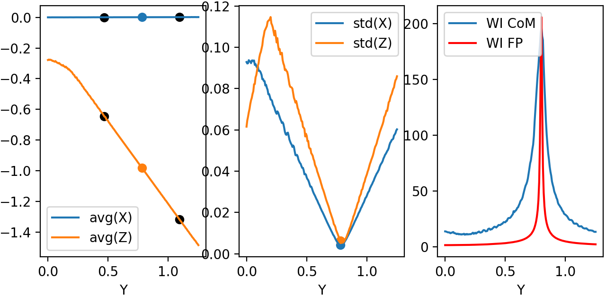

Examples
========

Following examples has the objective of explaining how orsaytrace works by means of interesting examples. In general,
examples are explained in ascending complexity, so one can use this section as a guide to comprehend our module.

Please also check the full API documentation for detailed explanation of every implemented function. Some of them
contain examples and can help you make better choice designing your optical experiment.

Pair of Lenses
--------------
The optical system is simply a pair of lenses with same focus :math:`f = 2` and clear aperture of :math:`ap = 1.5`. We
have used a perfect collimated source of :math:`d_{src} = 2` and distance between lenses are :math:`d = 6`.
This distance is relative to the plane sides of each lens as::

>>> a.create_thin_lens([0, 0, zlens1], focus1, 1.5, 1.43, 'convex-plane')

Creates a thin 'convex-plane' in which the center of the plane part is given by first position argument.
If we go block by block in our simulation::

>>> a = ot.Simu(5, 5, 20, res)

Creates the simulation cell size for a given resolution. In the next line::

>>> a.d2_source(r_src, [0, 0, -9.5], [0, 0, 1], 0.0, 1)

Creates a bi-dimensional source with a radius :math:`r_{src}` centered at :math:`[0, 0, -9.5]` and with photons
initially at the :math:`[0, 0, 1]` direction. Last two arguments are used for creating a diverging source (numerical
aperture). In this case we have set divergence at :math:`0.0` with a single photon in this direction.
After the creation of both lenses, we must create our analyses plans::

>>> for z in z_array:
>>>     a.create_analysis_plan([0, 0, 1], z)

Analyses plan are the core of orsaytrace. They bind together any photons that at any given time satisfies
the plane equation:

.. math::
    a x + b y + c z = d

Normal vector :math:`\vec{n} = [a, b, c]` and :math:`d` comes from first and second argument of
*create_analysis_plan*, respectively. Normal vector is not intensity sensitive, which means::

>>> a.create_analysis_plan([0, 0, 1], 1)

Will create same plan as::

>>> a.create_analysis_plan([0, 0, 2], 1)

Following, we can view our created elements using::

>>> a.show_created_elements('all-noplan')

And we can run our simulation by::

>>> photon_lists = a.run()

Simulation result is an numpy.array of shape based on the number of planes created. This is an *photon_list*
object and has several important attributes, such as *'.normal'* and *'.photons'*. This means that each index
of this list is a *photon_list* and each *photon_list* has a 'photons' attribute. As we will see in the future,
this class has also a 'condition_dict' attribute which forces the photon to have a specific property before
being appended to *photon_list*.

Optionally, one can also plug simulation result in::

>>> a.show_elements(photon_lists, 'all-noplan')

This will produce a 3D *matplot* lib with all the photons and elements created for each analysis plan. Pretty hand!

Results
*******

Note that after simulation is finished, we run a loop over our *photon_lists* object (the returned value
of simulation run). As we have said, those are planes and contain convenient functions to process the whole
set of *photons*. Just remember that each *photon* in *photon_list.photons* contains much more
information, such as its position, intensity, normal vector, number of reflections, refractions etc.
For the sake of clarity in this first example, we will show how to construct your own *avg_divergence*
if you do not want to use it from our function base::

>>> photon_list.avg_divergence([0, 0, 1])

You can construct your own in your python script something like this::

    import numpy

    def my_own_avg_divergence(vec_ref, photon_list.photons):
        vec_ref = vec_ref / numpy.linalg.norm(vec_ref)
        vals = numpy.average([numpy.dot(photon.normal, vec_ref)**2 for photon in photon_list.photons])
        return vals

This means that, for each *photon_list*, we are averaging the scalar product between the photon.normal
and a given reference vector. So if you have a perfect collimated source propagating in :math:`[0, 0, 1]` and applied
this function using a  :math:`[0, 0, 1]` reference vector, you would have a result of :math:`1.0` because all
individual photons are propagating in this direction and the scalar product is always :math:`=1.0`.

Other three functions are easier to understand. They calculate the average distance of the photons in xy plane
for a :math:`(x, y) = [0, 0]` position in::

>>> photon_list.avg_distance_axis_z([0, 0])

And calculate absolute position in :math:`3` dimensional for::

>>> photon_list.avg_position()

If one wish to see the created elements:

.. figure:: figures/Example01_res0-02_view.png
    :align: center

    Figure 1.1: View from show_elements using a resolution of 0.02.

.. figure:: figures/Example01_res0-05_side_view.png
    :align: center

    Figure 1.2: Side view from show_elements using a resolution of 0.05.

Figures below show quantitative results of the simulation. Look how divergence is :math:`= 1.0` at the beginning
and reduces almost abruptly as it reaches first lens. Second lens reduces slighly beam divergence relative
to :math:`[0, 0, 1]`. In the top right, we see beam starts with a :math:`0.15` size and reaches a minimum
during first focus. Second lens refocalizes the diverging beam of approximately :math:`0.30`. Beam reaches a
minimum and continues to diverge until simulation cell is over.

    Figure 1.3: Quantitative results from a resolution of 0.02.

Finally, both cells at the bottom show the average distance in :math:`X` and :math:`Y`. As simulation is
symmetrical relative to those axis, those must be values under our resolution factor. Both are :math:`100\times`
smaller than our resolution.

Code
****

examples01.py::

    import orsaytrace.trace as ot
    import numpy
    import matplotlib.pyplot as plt

    z_array = numpy.linspace(-9.0, 9.0, 101)
    focus1 = focus2 = 2.0
    zlens1 = -6.0
    d12 = 6.0
    res = 0.08
    r_src = 0.25

    a = ot.Simu(5, 5, 20, res)

    a.d2_source(r_src, [0, 0, -9.5], [0, 0, 1], 0.0, 1)

    a.create_thin_lens([0, 0, zlens1], focus1, 1.5, 1.43, 'convex-plane')
    a.create_thin_lens([0, 0, zlens1+d12], focus2, 1.5, 1.43, 'plane-convex')

    for z in z_array:
        a.create_analysis_plan([0, 0, 1], z)

    a.show_created_elements('all-noplan')
    photon_lists = a.run()
    a.show_elements(photon_lists, 'all-noplan')

    vals = numpy.asarray([])
    vals_distance = numpy.asarray([])
    vals_x = numpy.asarray([])
    vals_y = numpy.asarray([])
    for photon_list in photon_lists:
        vals = numpy.append(vals, photon_list.avg_divergence([0, 0, 1]))
        vals_distance = numpy.append(vals_distance, photon_list.avg_distance_axis_z([0, 0]))
        vals_x = numpy.append(vals_x, photon_list.avg_position()[0])
        vals_y = numpy.append(vals_y, photon_list.avg_position()[1])

    fig, axes = plt.subplots(nrows=2, ncols=2, sharex=False, sharey=False, dpi=200)
    axes[0, 0].plot(z_array, vals)
    axes[0, 1].plot(z_array, vals_distance)
    axes[1, 0].plot(z_array, vals_x)
    axes[1, 1].plot(z_array, vals_y)

    axes[0, 0].set_ylabel('Beam Divergence')
    axes[0, 1].set_ylabel('Distance from Optical Axis')
    axes[1, 0].set_ylabel('Average X')
    axes[1, 1].set_ylabel('Average Y')

    axes[0, 0].set_xlabel('Z (A.U.)')
    axes[0, 1].set_xlabel('Z (A.U.)')
    axes[1, 0].set_xlabel('Z (A.U.)')
    axes[1, 1].set_xlabel('Z (A.U.)')

    plt.show()

Scanning an object position
---------------------------

Second example is also pretty simple as well but has some key differences from previous one,
which makes it educative on some functions. We begin by creating a point source::

>>> a.d2_source(0.0, [0, 0, -4.0], [0, 0, 1], 0.12, 11)

With :math:`11\times11` points between normal vectors :math:`[0.12, 0.12, 1]` and :math:`[-0.12, -0.12, 1]`.
A single plane-convex lens is created and :math:`201` planes are created along photon propagation
direction :math:`[0, 0, 1]`. Lens position is changed in :math:`Z` direction given by *z_lens* array.

Results are saved in a list called *all_my_photons*. Each element of this list will contain 201 plans and each plan will constain a number given of photons saved
in photon_list.photons.

Results
*******

Again we use a convenient functions in class photon_list called::

>>> photon_list.std_deviation()

Which returns a :math:`3` dimensional array of the standard deviation of position values for each given plane.
We expect that standard deviation increases with the propagation of a diverging beam; stays constant for a
collimated beam and reduces for a converging beam. As we change lens :math:`Z` position, we will match source
and lens numerical aperture at a given point, producing a collimated beam with almost no divergence.

.. figure:: figures/Example02.png
    :align: center

    Figure 2.1: Measurement of 7 simulation points, 201 plans and 0.04 resolution.

Collimated output is found for a :math:`Z` position of :math:`z = -2.07`. Considering theoretical focal point
is at :math:`z = -2.0` as the source is at :math:`z= -4.0`, we see how thin lens approximations deviates less
than 5%. One can increase simulation resolution and scans more :math:`Z` points to find a convergent value.

Code
****

examples02.py::

    import orsaytrace.trace as ot
    import numpy
    import matplotlib.pyplot as plt

    ########## SIMULATION PARAMETERS ###########

    f = 2.0
    lens_pos = -2.5
    res = 0.04
    pts = 201
    sim_pts = 7

    z_plans = numpy.linspace(-4.5, 4.5, pts)
    z_lens = numpy.linspace(-2.5, -1.2, sim_pts)
    all_my_photons = list()

    for lens_pos in z_lens:

        a = ot.Simu(5, 5, 10, res)

        #Plane convex lens. Source is point source diverging.
        a.d2_source(0.0, [0, 0, -4.0], [0, 0, 1], 0.12, 11)
        a.create_thin_lens([0, 0, lens_pos], f, 1.75, 1.43, 'plane-convex')

        for z in z_plans:
            a.create_analysis_plan([0, 0, 1], z)

        #a.show_created_elements('all-noplan')
        all_my_photons.append(a.run())

    results = numpy.zeros((sim_pts, pts))

    for isim, simu_part in enumerate(all_my_photons):
        #a.show_elements(all_my_photons[isim], 'photons')
        for ilist, photon_list in enumerate(simu_part):
            results[isim, ilist] = (photon_list.std_position()[1])

    fig, axes = plt.subplots(nrows=1, ncols=1, sharex=False, sharey=False, dpi=200)

    for index, result in enumerate(results):
        axes.plot(z_plans, result, label='z_lens = ' + format(z_lens[index], '.2f'))

    axes.set_xlabel('Z')
    axes.set_ylabel('stdY')
    plt.legend()
    plt.show()

Exploring Rotation
------------------

This simple example shows a little more in-depth how one can visualize and explore some flexibility features of
this module. In order to rotate all elements with :math:`n_{refr} \neq 1.0`, One can use the rotation method::

>>> a.rotate(numpy.arcsin(-na), [0, 1, 0], [0, 0, zlens])

Rotation arguments can be viewed in full documentation, but it will basically rotate along axis :math:`[0, 1, 0]`
an amount of :math:`\theta = -arcsin(na)` centered at :math:`[0, 0, zlens]`, which is the center of flat surface
of the lens. In order to show the flexibility of plane construction, we create a  tiled plan tilted at the same
angle::

>>> a.create_analysis_plan([-na, 0, 1], z)

And finally we can use a source with different normal vector as well. Do not worry about vector normalization,
this is done during photon instantiation::

>>> a.d2_source(r, [0.5, 0.0, -4.5], [-na, 0, 1], 0.0, 1)

This would be roughly equivalent to a complete straight simulation. Note that rotate method is sensitive to call
order. If one creates a lens after rotate, you would have a rotated and an on-axis lens. Also note that you can
apply a ROI to your rotate method, selecting spatially which points to look up. This is also a less
time-consuming task.

Results
*******

First let us take a look at the first output. If you use *'all'* in *show_elements*, plan inspection is activated.

.. figure:: figures/Example03_res0-05_other_view.png
    :align: center

    Figure 3.1: Measurement of a rotated source, lens and planes. 7 plans and a resolution of 0.05.

Rotation of all objects can be clearly seen, but a few photons also looks a little bit misplaced. This happens
because rotation is a tricky transformation in a mesh. You need to rotate both the point and normal which not
always corresponds to exactly same absolute values due to finite volume of each grid cube.

A way of reducing dramatically this problem without the need of increasing resolution, is by using conditional
plans. As *'refraction_count'* and *'reflection_count'* are *photon* attributes, you can pass them as a keyword
argument. Check full documentation for more info. To use this feature, one simply:

>>> a.create_analysis_plan([-na, 0, 1], z, refraction_count=(1, 2))

This will restrain to photons that have refracted :math:`1\leq ct_{rf}\leq 2`. Result of this simulation is
shown in Figure 3.2. Note how plans before the lens have no photons because they have not already found
a refractive (or reflective) element.

    Figure 3.2: Measurement of a rotated source, lens and conditional planes. Resolution is 0.05.

Finally, if we hide plans inspection and turn simulation for much more plans, we would see:

    Figure 3.3: Measurement of a rotated source, lens and conditional planes. Resolution is 0.05.

Code
****

example03.py::

    import orsaytrace.trace as ot
    import numpy
    import matplotlib.pyplot as plt

    z_array = numpy.linspace(-4.5, 4.5, 51)
    res = 0.04

    focus = 2.0
    zlens = -2.0
    r = 0.25
    na = 0.2

    # This example simple shows how to apply rotation to itens

    a = ot.Simu(5, 5, 10, res)

    a.d2_source(r, [0.5, 0.0, -4.5], [-na, 0, 1], 0.0, 1)
    a.create_thin_lens([0, 0, zlens], focus, 1.5, 1.43, 'convex-plane')
    a.rotate(numpy.arcsin(-na), [0, 1, 0], [0, 0, zlens])

    for z in z_array:
        a.create_analysis_plan([-na, 0, 1], z, refraction_count=(1, 2))

    photon_lists = a.run()
    a.show_elements(photon_lists, 'all-noplan')
    #a.show_elements(photon_lists, 'all')

    div_z = numpy.asarray([])
    div_tilted = numpy.asarray([])
    for photon_list in photon_lists:
        div_z = numpy.append(div_z, photon_list.avg_divergence([0, 0, 1]))
        div_tilted = numpy.append(div_tilted, photon_list.avg_divergence([-na, 0, 1]))

    fig, axes = plt.subplots(nrows=1, ncols=2, sharex=False, sharey=False)
    axes[0].plot(z_array, div_z)
    axes[1].plot(z_array, div_tilted)

    axes[0].set_ylabel('Beam Divergence')
    axes[1].set_ylabel('Beam Divergence')

    axes[0].set_xlabel('Z (A.U.)')
    axes[1].set_xlabel('Z (A.U.)')

    plt.show()

Other Geometries
----------------
In this example, we study how a collimated source behaves when reflected by a off-axis parabolic mirror.
The idea is to construct a parabolic surface and remove its upper part using a rectangular element.

At the beginning, we define a few constants that are important in order to understand the problem. *Focus*
is the distance, in :math:`Y` direction, of the top of the parabolic surface to its vertex. *yvertex* is the
:math:`Y` vertex position. Source is at :math:`[0, 0, -5]`, which means source center in :math:`Z` axis is
arriving in the lower bottom part of the mirror.

We have created several plans in :math:`Y` direction with the condition of a minimal of one reflection::

>>> for y in y_array:
>>>    a.create_analysis_plan([0, 1, 0], y, reflection_count = 1)

In this example, several built-in functions available to *photon_list* class have been used. New functions relative
to previous examples are::

>>> photon_list.get_average_weighted_inverse()
>>> photon_list.get_average_weighted_inverse_axis_y([0, -p/2.])

The first computes the weighted inverse distance of each photon relative to average photon position.
Second function computes the weighted inverse distance relative to a given point; in this case, we have
used point in :math:`X\times Z` plan :math:`[0, -p/2]`. As we know from a parabola, this is its focal point.

.. note::
    The weight in those functions comes from intensity photon attribute. By default, they are equal to a unity
    and means we are basically counting photons. It is easy to run a loop over the initial photon list and change
    its intensity based on another attribute, such as photon position.

.. figure:: figures/Example04_begin.png
    :align: center

    Figure 4.1: Simulation starting conditions using a resolution of 0.05.

Figures 4.1 explains our simulation initial conditions. Photons arrive with no divergence and converges
to the parabola focal point. In order to examine this problem, we will plot position average and standard
deviation for :math:`X \times Z` coordinates. We will also calculate the inverse of the distance using
two reference points, as explained before.

In practice, first weighted inverse (from average position) is a moving point. It goes along photons
center of mass and we will see it propagating when we plot the average for :math:`X \times Z` coordinates.
Second weighted inverse is a static point. We will discuss the meaning of it in results.

.. figure:: figures/Example04_end.png
    :align: center

    *igure 4.2: Simulation end point using a resolution of 0.05.

As we will se in results, we have also performed rotation measurements. Rotation method checks
for active grid point, such as :math:`n_{refr} \neq 1`. It is an expensive method because it does
not know previous what the user have added to the grid. In this sense, we can perform smarter rotations
if you understand your problem. In this case, we have done a rotation using the ROI correspondent
to incident photons.

.. figure:: figures/Example04_rotation.png
    :align: center

    Figure 4.3: Rotation regions was not performed in the whole parabolic mirror.

Results
*******

First simulation was done using a straight mirror, with no tilt :math:`\theta = 0 ^{\circ}`.
Figure 4.4 shows several expected results. :math:`X` average (top left) does not change during
beam propagation, while :math:`Z` became more and more negative, meaning beam has a reflective
component that faces the initial source. Standard deviation in top center shows we have
an non-astigmatic source and both :math:`X` and :math:`Z` focus at the same point. Top right shows that beam
has an much more smaller apparent depth of focus in :math:`Y` axis with respect to its focal point
when compared to propagation axis (not aligned with :math:`Y` axis).

    Figure 4.4: Left: Average position for X-Z. Center: Standard deviation for X-Z. Right: Weighted inverse for center of
    mass and for parabola focal point.

Figure 4.5 shows snapshots of beam in :math:`3` different :math:`Y` planes, where the center one is defined by
the minimum of the standard deviation (focal point). We see focal point corresponds to
:math:`(X, Z) = (0, -p/2)`. We also see that beam propagates somewhat with a elliptical shape.

.. figure:: figures/Example04_res0-008_02.png
    :align: center

    Figure 4.5: Three distinct snapshots of the beam propagating in Y direction. Position are relative to
    the black dots shown in previous average figure.

In Figure 4.6, we have used animation module present in the standard matplotlib library to produce
an animated image .gif::

>>> from matplotlib.animation import FuncAnimation, PillowWriter

.. figure:: figures/Example04_res0.008.gif
    :align: center

    Figure 4.6: Left: Animation of X-Z plane of the beam propagating in Y axis.

In order to check the effect of mirror tilting, we added a :math:`\theta = \frac{\pi}{64} \approx 2.8^{\circ}`
with respect to the :math:`[0, 1, 0]` direction, as shown in Figure 4.3. Beam does not cross
:math:`(x, z) = (0, -p/2)` simply because rotation changed focal point. Using centroid we see weighted inverse
does not change much. Source is still non-astigmatic with respect to :math:`Y` axis.

.. figure:: figures/Example04_res0-01_tilted_pi-64.png
    :align: center

    Figure 4.7 Left: Average position for X-Z. Center: Standard deviation for X-Z. Right: Weighted inverse for
    center of mass and for parabola focal point. Beam rotated with respect to Y.

Snapshots show that beam is propagating in :math:`X` axis as well, as expected by a rotation in this direction.
Center of mass :math:`Z` propagation is pretty much the same.

.. figure:: figures/Example04_res0-01_02_tilted_pi-64.png
    :align: center

    Figure 4.8: Three distinct snapshots of the beam propagating in Y direction. Positions are relative to
    the black dots shown in previous average figure. Beam rotated with respect to Y.

Finally, we can also export a .gif animation in order to see beam propagation.

.. figure:: figures/Example04_res0-01_pi-64_tilted.gif
    :align: center

    Figure 4.9: Left: Animation of X-Z plane of the beam propagating in Y axis. Beam rotated with respect to Y.

Let us add a :math:`\theta = \frac{\pi}{16} \approx 11.2^{\circ}` rotation along :math:`X` axis. Results
interpretation is pretty much the same as we did in the last two examples. Beam is now propagating more closely
to a :math:`\theta = \frac{\pi}{2}` trajectory, so :math:`Z` propagation reduces dramatically. For this example,
analyses plans were slightly modified. We have used a higher portion of :math:`Y` semi space and double of points::

>>> y_array = numpy.linspace(0, y/3, 401)

    Figure 4.10 Beam rotated with respect to X.

First it is important to note how the beam now looks very astigmatic,

.. figure:: figures/Example04_res0-01_tilted_pi-16-X-axis.png
    :align: center

    Figure 4.11 Left: Average position for X-Z. Center: Standard deviation for X-Z. Right: Weighted inverse for
    center of mass and for parabola focal point. Beam rotated with respect to X.

Snapshots show that beam is propagating less in :math:`Z`. Beam is symmetric relative to :math:`X`
(divergence smaller than resolution).

.. figure:: figures/Example04_res0-01_02_tilted_pi-16-X-axis.png
    :align: center

    Figure 4.12: Three distinct snapshots of the beam propagating in Y direction. Position are relative to
    the black dots shown in previous average figure. Beam rotated with respect to X.

If we export a .gif animation in order to see beam propagation, we have the following

    Figure 4.13: Left: Animation of X-Z plane of the beam propagating in Y axis. Beam rotated with respect to X.

Code
****

example04.py::

    import orsaytrace.trace as ot
    import numpy
    import matplotlib as mpl
    mpl.use('TkAgg')
    import matplotlib.pyplot as plt
    from matplotlib.animation import FuncAnimation, PillowWriter

    x, y, z, res = 5, 5, 10, 0.04

    focus = 0.3
    yvertex = 0.8
    thickness = 1.2
    p = 2.0
    r = 0.2

    xmax, xmin, zmax, zmin = 0.35, -0.35, -0.25, -2.0

    y_array = numpy.linspace(0, y/4, 201)

    a = ot.Simu(x, y, z, res)

    a.d2_source(r, [0, 0, -z/2], [0, 0, 1], 0.0, 1)

    a.create_parabolic_surface_element([0.0, yvertex, 0.0], -1.0, 2*thickness, 3.0, p)
    a.create_rectangle_element([-x/2, x/2, yvertex-focus, y/2, -z/2, z/2], 1.0, [0, 0, 0])
    #a.rotate(numpy.pi/64, [0, 1, 0], [0, yvertex, 0.0], [-0.5, 0.5, -0.5, 0.5, -2.0, 0])

    for y in y_array:
        a.create_analysis_plan([0, 1, 0], y, reflection_count = 1)

    #a.show_created_elements('all-noplan')
    photon_lists = a.run()
    #a.show_elements(photon_lists, 'all-noplan')

    pd = numpy.asarray([photon_list.get_average_weighted_inverse() for photon_list in photon_lists])
    pdvertex = numpy.asarray([photon_list.get_average_weighted_inverse_axis_y([0, -p/2.])for photon_list in photon_lists])
    avg = numpy.asarray([photon_list.avg_position() for photon_list in photon_lists])
    pos_max = numpy.asarray([photon_list.max_position() for photon_list in photon_lists])
    pos_min = numpy.asarray([photon_list.min_position() for photon_list in photon_lists])
    std = numpy.asarray([photon_list.std_position() for photon_list in photon_lists])

    list_number = (numpy.where(std[:, 0]==min(std[:, 0])))[0][0]
    fac = 50

    fig, axes = plt.subplots(nrows=1, ncols=3, sharex=False, sharey=False, dpi=200)
    axes[0].plot(y_array, avg[:, 0], label='avg(X)')
    axes[0].scatter(y_array[list_number], avg[list_number, 0])
    axes[0].plot(y_array, avg[:, 2], label='avg(Z)')
    axes[0].scatter(y_array[list_number], avg[list_number, 2])

    axes[0].scatter(y_array[list_number-fac], avg[list_number-fac, 0], c='black')
    axes[0].scatter(y_array[list_number+fac], avg[list_number+fac, 0], c='black')
    axes[0].scatter(y_array[list_number-fac], avg[list_number-fac, 2], c='black')
    axes[0].scatter(y_array[list_number+fac], avg[list_number+fac, 2], c='black')

    axes[0].set_xlabel('Y')
    axes[0].legend()

    axes[1].plot(y_array, std[:, 0], label='std(X)')
    axes[1].scatter(y_array[list_number], std[list_number, 0])
    axes[1].plot(y_array, std[:, 2], label = 'std(Z)')
    axes[1].scatter(y_array[list_number], std[list_number, 2])
    axes[1].set_xlabel('Y')
    axes[1].legend()

    axes[2].plot(y_array, pd, label='WI CoM')
    axes[2].plot(y_array, pdvertex, label='WI FP', c='red')
    axes[2].set_xlabel('Y')
    axes[2].legend()
    plt.show()

    lists_pos = numpy.asarray([photon_list.get_positions() for photon_list in photon_lists])

    fig, axes = plt.subplots(nrows=1, ncols=3, sharex=False, sharey=False, dpi=200)
    axes[0].hist2d(lists_pos[list_number-fac][:, 0], lists_pos[list_number-fac][:, 2], 100, range=[[xmin, xmax], [zmin, zmax]])
    axes[1].hist2d(lists_pos[list_number][:, 0], lists_pos[list_number][:, 2], 100, range=[[xmin, xmax], [zmin, zmax]])
    axes[2].hist2d(lists_pos[list_number+fac][:, 0], lists_pos[list_number+fac][:, 2], 100, range=[[xmin, xmax], [zmin, zmax]])

    axes[0].scatter([0], [-p/2], c='red', alpha=0.3)
    axes[1].scatter([0], [-p/2], c='red', alpha=0.3)
    axes[2].scatter([0], [-p/2], c='red', alpha=0.3)

    axes[0].set_xlabel('X'); axes[0].set_ylabel('Z')
    axes[1].set_xlabel('X'); axes[1].set_ylabel('Z')
    axes[2].set_xlabel('X'); axes[2].set_ylabel('Z')
    plt.show()

    fig, ax = plt.subplots()
    plt.hist2d(lists_pos[0][:, 0], lists_pos[0][:, 2], 101, range=[[xmin, xmax], [zmin, zmax]])

    def init():
        pass

    def update(i):
        plt.clf()
        plt.hist2d(lists_pos[int(i)][:, 0], lists_pos[int(i)][:, 2], 101, range=[[xmin, xmax], [zmin, zmax]],
                   cmap=plt.cm.jet)
        plt.text(0.18, -0.4, 'y = '+format(y_array[i], '.2f'), fontsize=12, color='white', weight='bold')
        plt.xlabel('x')
        plt.ylabel('z')
        plt.title('X-Z Plan')
    ani = FuncAnimation(fig, update, range(len(y_array)), init_func=init)

    writer = PillowWriter(fps=40)
    ani.save("demo_parabolic.gif", writer=writer)

Multi Processing
----------------

In this example, we show how can one use python standard library
`multiprocessing <https://docs.python.org/3/library/multiprocessing.html#module-multiprocessing/>`_ in order
to perform simulations using multiple processes. User must call a few methods in order to enable them.
First one is::

>>> prepare_acquisition(nproc)

Which splits your initial photons in *nproc* number of equal divisions. Each one of those subsets will be run
in a different process.

.. note:: Calling run function will always call prepare_acquisition object. If no multiprocessing is used,
    nproc = 1 and photon list is identical to initial photon list.

Second step is to use the *Manager()* object from multiprocessing library. In this example we will use a
dict type in order to callback to our main function the results from our simulation. An example on how to do
it is simply::

>>> manager = multiprocessing.Manager()
>>> return_dict = manager.dict()
>>> jobs = []
>>> for i in numpy.arange(0, nproc)
>>>     p = multiprocessing.Process(target=a.run, args=(i, True, return_dict))
>>>     jobs.append(p)
>>>     p.start()

In this case we created a list called jobs with all our processes and started them all using p.start().
return_dict - our *manager.dict()* is passed as an argument. Run function deals with this values copying
its the habitual return function in return_dict.

.. note:: Currently run function only supports return_dict from type *multiprocessing.managers.DictProxy*.
    Please fell free to improve this approach
    in our `GitHub <https://github.com/yvesauad/OrsayTrace/>`_ repository.

The third part is to call merge_photon_lists using the values retrieved by our return dict. In order to wait
for results, you can call *join()* before. This way you guarantee process is over and added values are meaningful
ones::

>>> for index, proc in enumerate(jobs):
>>>     proc.join()
>>>     a.merge_photon_lists(return_dict.values()[index])

Please be careful to do not call this function several times. There is no way to check if the photon has been
already added to the list or not at the moment. Calling several times will add repeated photons to your main
photon_lists. If user want to see each subset of photon that was ran by an specific process, one can use::

>>> show_elements(return_dict.values()[index], 'all-noplan-verbose')

In which -verbose prints in the terminal the number of photons in each plan. You can see that if you run the same
code at the end after merge_photon_lists, your number of photons will be the sum of each individual core.

Results
*******

In Figure 5.1, we compare a small/medium sized simulation in three different conditions. First two uses the same
computer and processor, but running different operational systems. The machine has a
`Intel I7-8665U <https://ark.intel.com/content/www/fr/fr/ark/products/193563/intel-core-i7-8665u-processor-8m-cache-up-to-4-80-ghz.html>`_
processor with 32 Gb of RAM (RAM was not a limiting factor here). Second machine uses two 12 core (24 thread)
`Intel Xeon Silver 4214 <https://www.intel.fr/content/www/fr/fr/products/processors/xeon/scalable/silver-processors/silver-4214.html>`_
processor with 200 Gb RAM using windows 10 as an OS. It is a dedicated computer to perform heavy simulations.

Simulation were done using a :math:`(5, 5, 5)` cell with :math:`0.05` resolution. :math:`30` analyses plans
were put and a point source spawned angles with :math:`na = 0.39` within :math:`101` angles. All photons were
merged at simulation end and time shown is that total time calculated using::

>>> from time import perf_counter

    Figure 5.1: Performance with different machine conditions. We have compared a Intel i7 8665U
    and a Intel Xeon Silver 4214 processors running Windows 10 OS. Ubuntu 20.04 was also compared
    to Windows 10.

We readily see that Intel Xeon 4214 loses to both other conditions. For single core, there is no reason they
differ much, as processor core frequency are similar for both processors. Intel i7 running W10, however, shows a
better performance due to its turbo maxi of :math:`4.80 Ghz` when using a single core. For 2-4 cores, linux appears
to be the best between them all, probably due to the differences in starting process between Unix and Windows.

.. seealso::

    Check `Context and start methods
    <https://docs.python.org/3/library/multiprocessing.html#contexts-and-start-methods>`_ in multiprocessing page
    to learn more about *spawn*, *fork* and *forkserver* methods.

A huge factor prevented us in the simulation above to achieve a performant multiprocessing task. In this
orsaytrace version, parallel processing can be done during running factor, but not in creating structures
and appending photons using the *return_dict*. If one has a high number of plans and all photons cross that
plan (which is this case), we need to append :math:`n_{plans}*photons` in a serial manner. This demands
the same time independently from number of processing. In the case above, this defines simulation
base line in time and was approximately 8 minutes.

Another factor that prevents is the small simulation size, which sometimes means that simulation do not even
reach all processes running because the first ones were already finished when others are being placed.

In order to understand better the impact of multiprocessing library, we have performed a simulation with a
single plan, a point source spawning :math:`101` plans over a very narrow numerical aperture :math:`0.0005`
in a cell size of :math:`(1, 1, 320)`. Resolution was set to :math:`0.02` and total number of photons
were :math:`31320`.

Figure 5.2 shows the result. Time goes very close to photons/core, which means truly independent parallel
tasks and reduces total simulation time from :math:`4 h` to :math:`13 min`, a factor of :math:`18` when using
42 processes (computer runs with 48 logical processors). We see however that we reach a plateau when going
beyond the :math:`24` physical cores. A factor of :math:`17` is gained in simulation time from :math:`1` to
:math:`24` cores.

.. figure:: figures/Example05_02.png
    :align: center

    Figure 5.2: Performance using a Intel Xeon Silver 4214 for multiprocessing. We have used from 1 to
    42 processes. Machine has 24 physical cores and 48 logical processors.

Code
****

example05.py::

    import orsaytrace.trace as ot
    import numpy
    import multiprocessing
    import time

    for nproc in [1, 2, 4, 8, 12]:
        if __name__ == "__main__":

            x, y, z, res = 5, 5, 5, 0.05
            z_array = numpy.linspace(-z / 4, +z / 4, 30)
            angles = 2

            start = time.perf_counter()

            manager = multiprocessing.Manager()
            return_dict = manager.dict()
            a = ot.Simu(x, y, z, res)

            a.d2_source(0.0, [0, 0, -z/4], [0, 0, 1], 0.39, angles)

            for z in z_array:
                a.create_analysis_plan([0, 0, 1], z)

            a.prepare_acquisition(nproc)

            jobs = []
            for i in numpy.arange(0, nproc):
                p = multiprocessing.Process(target=a.run, args=(i, True, return_dict))
                jobs.append(p)
                p.start()

            for index, proc in enumerate(jobs):
                proc.join()
                a.merge_photon_lists(return_dict.values()[index])

            end = time.perf_counter()

            f = open('mp.txt', 'a+')
            f.write(str(angles) + '_' + str(nproc) + '_' + str(end - start)+ '\n')
            f.close()

